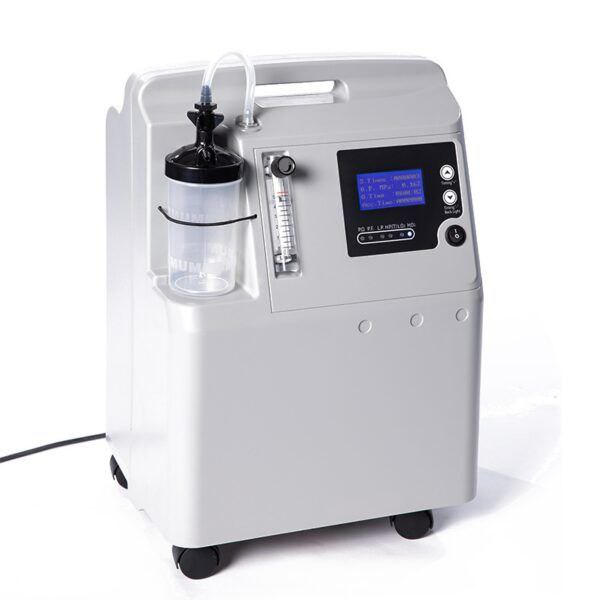

# Oxygen Flow Control System Using PID Control

## Overview
This repository presents the modeling and simulation of a closed-loop oxygen flow control system intended for medical device applications.  
The project focuses on control-oriented modeling and PID-based regulation of oxygen flow, a critical function in systems such as oxygen concentrators and ventilatory support equipment.

The objective is to analyze system dynamics, design a suitable PID controller, and evaluate closed-loop performance through time-domain simulations.

---

## Medical Device Image

## System Description

### Oxygen Flow Regulation
Oxygen delivery systems require accurate and stable flow control to ensure safe operation.  
In this project, oxygen flow is regulated by controlling an electrically actuated valve based on feedback from the measured flow rate.

### Oxygen Valve Modeling
The oxygen valve is modeled as a first-order dynamic system to represent realistic physical behavior observed in proportional medical valves:

G(s) = K / (τs + 1)

This model captures:
- Dynamic response of the valve
- Actuation delay and inertia
- Practical behavior suitable for control analysis

### Control Strategy
A PID controller is implemented to:
- Track the desired oxygen flow rate
- Reduce steady-state error
- Improve transient response and stability

The controller parameters are tuned to achieve an acceptable balance between response speed and overshoot.

---

## Control Architecture

Closed-loop structure:

PID Controller → Oxygen Valve Model → Oxygen Flow  
                                     ↑  
                                Feedback

---

## Simulation Results

The following figure illustrates the closed-loop step response of the oxygen flow control system after PID tuning.

The response demonstrates stable behavior with satisfactory transient performance.

---

## Tools and Environment
- MATLAB
- Control Systems Toolbox  
- Simulink (to be integrated)

---

## Project Status
This project represents an initial control and simulation stage.
Planned extensions include:
- Full Simulink block diagram implementation
- Enhanced valve and sensor modeling
- Comparative analysis of PID tuning methods

---

## Notes
This work follows a control-oriented modeling approach commonly used in early-stage medical device development, focusing on system behavior and control performance rather than full hardware implementation.

## Applications
- Oxygen concentrators
- Ventilators
- Anesthesia machines
